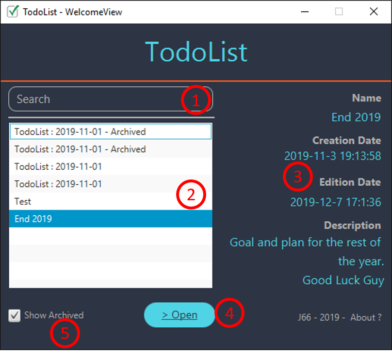
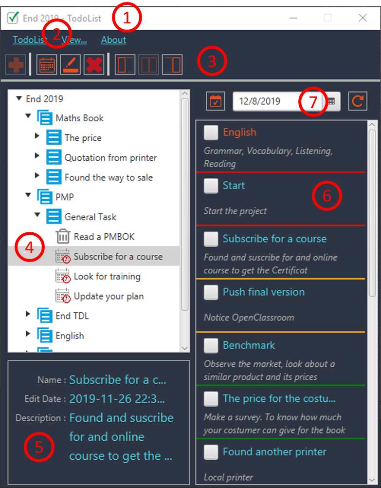
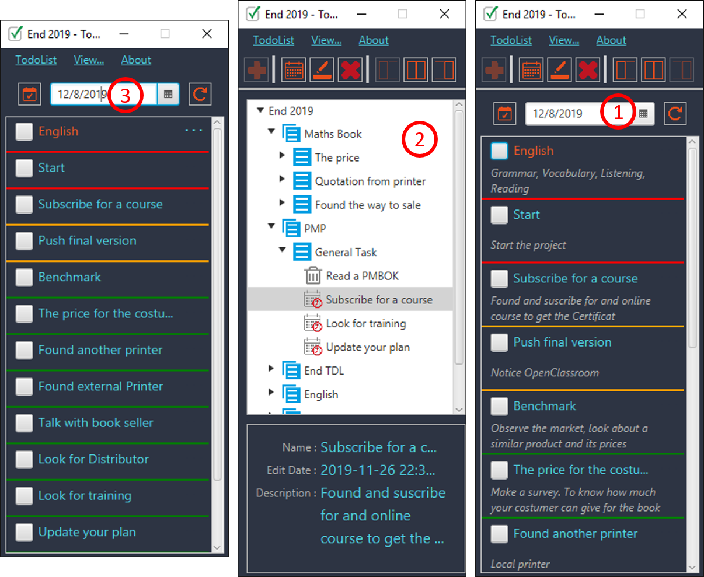
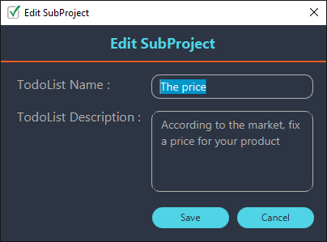
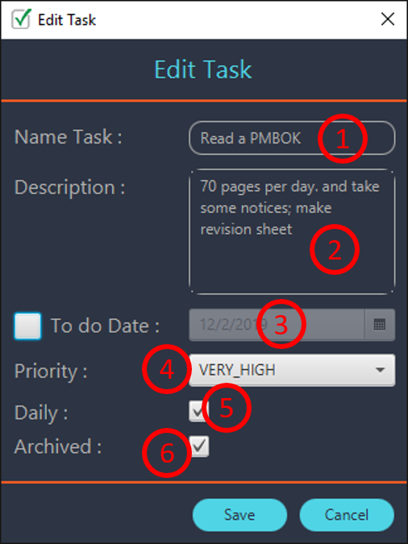
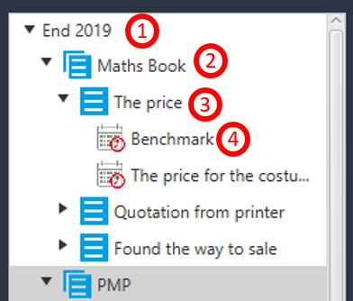
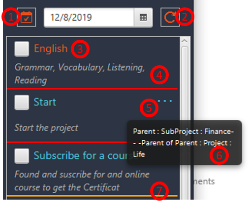
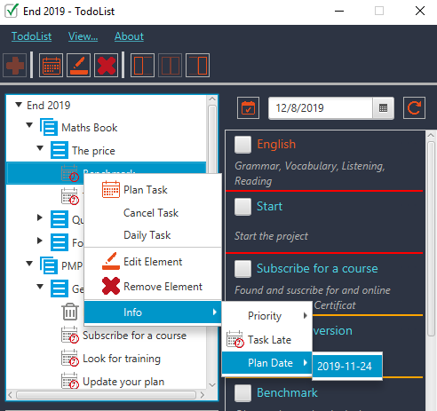
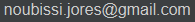

# TodoList_1_0
Just a basic java app to manage TodoList as task in project management.

In this file, you'll find basic Github readme information and a small presentation of the application.

## Summary
1. Basic Github information
2. Presentation and tutorial

## 1. Basic Github Information
### 1.Installation
TodoList is a JavaFX application. In this repository, we have all necessary file to run the application in a Java IDE.
For a daily easy use, you can create a .jar file(the main class is j66.free.tdlist.Main). The folder ___files___ must be in the same directory than the .jar file.

You could have some problems to run the .jar file, you must check that you use a jre with javafx to open .jar files in your computer.

This application has been developed with java jdk 12.0.1 and my test with jre 8.0.211
### 2.Contribution
Just do a pull request, it'll be a pleasure to receive your contribution.
### 3.Version
This repository contain the version 1.0 of TodoList.
### 4.Licence
The application is shared with a Common Creative Licence : BY - NC - SA.
### 5.Author
[Jores NOUBISSI](https://www.linkedin.com/in/jores-noubissi-82a69b54/)
 
## 2. Presentation and tutorial
### 1.Introduction

I like todo-list, I think it's very useful and a big tool to manager personal, social and professional activities.
I have used basic todo-list for a long time, but in general, my todo-list was just a piece of paper with a date a some tasks.
But something I had some problem with those paper :
* Generally, a todo-list is for a day, or a week, or a project : it was difficult to put far future tasks in this list
* It was difficult to create and hierarchy between tasks and make priority
* Most a time those paper were lost in a million of others paper

So I have created TodoList to get a powerful and basic application which can manage my tasks, grouped in projects or sub-projects :
* with a logical organisation
* with some priorities
* through the time

### 2.View description
There are many view through the application, we present 4:
* The welcome view
* The main content view and its sub-views
* Edit Element view
* Edit Tasks view

#### 1.The Welcome View
When you open the application, you get the Welcome View.

>1. Research array
>2. List TodoLists/Files
>3. Information about selected todoList
>4. Open the selected file
>5. Show archived files or not

On the listView, we also have a context menu :
* For the opening or copy of a todoList
* For the archiving or deleting of a todoList
* For the edition or creation of a todoList

#### 2.The Main Content View
This view has many options, we will just present the most important, It's often intuitive, so you can discover the rest by yourselves.

##### a.General description of both View
When you open a todoList, you get the main content view.

>1. Title bar : with the opened todoList name
> 2. Menu bar
>    1. TodoList : Return to Welcome View, Save actual todoList, Quit application
>    2. View : Slim View, Hierarchy View, TodoList View
>    3. About the application
>3. Tool bar
>    1. Add and element
>    2. Plan a task, edit or delete and element
>    3. Views
>4. Hierarchy View : Projects, Sub-projects, Tasks
>5. Information about selected element
>6. TodoList View : list of task of the selected day
>7. Selected day

##### b.Sub Views
We have 3 sub Views, accessible in View menu.

>1. TodoList View : To be focus on your daily task
>2. Hierarchy View : To be focus on your project hierarchy
>3. Slim View : to have a small window with daily task and necessary information

##### c.Edit Element View
It is a small view just to enter name and description for a new element
* TodoList
* Project
* Sub project

##### d.Edit Task View
A task view is an element view with more information.

>1. The Task' mane
>2. The Task' description
>3. Plan Task or not / plan date
>4. The Task priority
>5. Daily Task or not / A daily task is a task to do every day
>6. Archived or not / An archived task is a task which is not more plan  
   
### 3.Other Information

In this part, we present some little information :
* The hierarchy structure
* TodoList description
* Context menus

#### 1.Hierarchy structure

>1. The name of the current todoList
>2. The project name
>3. The sub project name
>4. The task name

a task can be :
* Orphan : directly connected to the todoList
* child of a project
* child of a sub project

#### 2. TodoList description

>1. Get today todoList
>2. Refresh actual todoList
>3. Name of the task with checkbox for done or not
>4. Task description
>5. ... for a context menu
>6. Tooltip which present the task parent
>7. A line which present the task priority

#### 3. Context menus

Through the application we have a lot of context menu which help you to manage your todoLists.
For more information don't hesitate to send me a message.

